# AIUI: AIUI-Grade Autonomous Software Engineer Architecture Blueprint

## 1. Executive Summary & Core Philosophy

The fundamental difference between a **conversational coding assistant** and an **autonomous software engineer (like AIUI)** is not model parameter size; it is **closed-loop verification**, **surgical environment interaction**, and **hierarchical cognition**.

- **A conversational assistant** predicts what code might look like, writes it out in full, and halts, leaving compilation, debugging, reproduction, and verification to the human operator.
- **An autonomous SWE agent** functions as an empirical investigator:
  1. **Forms a hypothesis** and constructs an automated reproduction test that deterministically fails (`exit code != 0`).
  2. **Inspects code structure** surgically using AST symbols and ripgrep rather than dumping raw file contents.
  3. **Applies surgical diffs** rather than overwriting whole files to eliminate line drift and context exhaustion.
  4. **Executes tests against real runtimes**, observing runtime exceptions, stack traces, and exit codes.
  5. **Inspects visual web interfaces** with a headless browser, checking network payloads and DOM states.
  6. **Iterates until proof-of-work** is established: the reproduction test passes, existing regression suites stay green, and the git diff is clean.

This document details the architectural blueprint and concrete implementation roadmap to elevate **AIUI** into a AIUI-grade autonomous software engineering system.

---

## 2. Architectural Comparison Matrix

```mermaid
graph TD
    subgraph "Current AIUI Model"
        A1[User Prompt] --> B1[Interactive REPL / CLI]
        B1 --> C1[System Prompt + 4-Pillar Deliberation]
        C1 --> D1[Linear Tool Calls: bash / write_file]
        D1 --> E1[Circuit Breaker / MemPalace Lesson]
        E1 --> F1[Agent Turn Ends]
    end

    subgraph "AIUI-Class Autonomous Agent"
        A2[User Objective] --> B2[Lead Architect / Orchestrator]
        B2 --> C2[Milestone Decomposition & Acceptance Criteria]
        C2 --> D2[Worker Subagent - Clean Context]
        
        subgraph "Autonomous Sandbox Loop"
            D2 --> E2[1. Repro Script Creation]
            E2 -->|Asserts Failure| F2[2. AST & Ripgrep Discovery]
            F2 --> G2[3. Surgical Diff / Search-Replace]
            G2 --> H2[4. Persistent PTY & Background Process]
            H2 --> I2[5. Headless Browser Visual Audit]
        end
        
        I2 --> J2[Proof-of-Work Verification Engine]
        J2 -->|Test Fails / Regressions| D2
        J2 -->|Deterministic Proof: Exit 0| K2[Critic & Linter Gate]
        K2 --> L2[Unified Git Diff & Milestone Advancement]
        L2 --> B2
    end
```



| Architectural Dimension | Current AIUI Implementation | AIUI-Grade Target Implementation |
| :--- | :--- | :--- |
| **Code Modification** | Whole-file rewrite (`write_file`) | **Surgical Search-and-Replace Hunks (`replace_file_content`)** & Unified Diffs |
| **Code Navigation** | Linear `read_file` (full or line-range) | **AST Symbol Tree (`file_symbols`)** + Ultra-fast **Ripgrep (`grep_search`)** |
| **Verification Loop** | Turn ends when LLM outputs completion text | **Automated Proof-of-Work Pipeline**: Repro $\rightarrow$ Patch $\rightarrow$ Test pass $\rightarrow$ Regression suite |
| **Terminal Runtime** | Ephemeral `child_process.exec()` | **Persistent PTY Sessions** + **Background Process Daemon Supervisor** |
| **Visual / UI Audit** | Public HTTP GET (`http_get_json`) | **Headless Browser Agent (Playwright)**: DOM clicks, screenshots, console log scraping |
| **Context Management** | Slicing last 12 messages in memory | **Hierarchical Subagents**: Orchestrator delegates to isolated workers with fresh context |
| **User Interface** | Terminal REPL + Standalone Web UI | **AIUI Quad-Pane Workspace**: Chat + Live PTY + Monaco Diff + App Viewport |

---

## 3. The 6 Core Engineering Pillars

### Pillar 1: Surgical Code Intelligence & Exact Diff Engine

#### The Problem with Whole-File Overwrites
When an agent rewrites an entire 800-line file via `write_file` just to modify 3 lines:
- It consumes thousands of unnecessary context tokens.
- It frequently truncates code with comments like `// ... rest of code unchanged ...`, causing catastrophic syntax corruption.
- It introduces line drift, breaking imports and surrounding variable scopes.

#### The Solution: Exact Hunk Search-and-Replace
Implement `replace_file_content` and `multi_replace_file_content` into the agent toolset:

```json
{
  "name": "replace_file_content",
  "description": "Surgically replace an exact, unique block of code within a file without modifying the rest of the file.",
  "parameters": {
    "type": "object",
    "properties": {
      "path": { "type": "string", "description": "Target file path" },
      "target": { "type": "string", "description": "The exact character sequence to be replaced (must be unique)" },
      "replacement": { "type": "string", "description": "The replacement code" }
    },
    "required": ["path", "target", "replacement"]
  }
}
```

#### Fast Code Discovery with Ripgrep and Symbol Outlines
Rather than listing directories recursively or reading entire files, provide:
1. `grep_search`: Ripgrep integration (`rg -n --column --hidden`) supporting regex and glob filters.
2. `get_file_outline`: Tree-sitter or regex-based AST symbol extractor returning function, class, and interface signatures with their exact line numbers.

---

### Pillar 2: Autonomous "Proof-of-Work" Verification Pipeline

The defining signature of an autonomous engineer is that **it does not ask the human to test its work**. It produces deterministic proof of correctness.

```
       ┌────────────────────────────────────────────────────────┐
       │             Step 1: Write Reproduction Test            │
       │    (e.g., repro_bug.py, test_feature.mjs, curl test)   │
       └───────────────────────────┬────────────────────────────┘
                                   │
                                   ▼
       ┌────────────────────────────────────────────────────────┐
       │            Step 2: Confirm Baseline Failure            │
       │       Exit Code != 0 / Assertion Error Confirmed       │
       └───────────────────────────┬────────────────────────────┘
                                   │
                                   ▼
       ┌────────────────────────────────────────────────────────┐
       │             Step 3: Apply Surgical Code Fix            │
       │          (replace_file_content on target file)         │
       └───────────────────────────┬────────────────────────────┘
                                   │
                                   ▼
       ┌────────────────────────────────────────────────────────┐
       │            Step 4: Execute Verification Gate           │
       │    Re-run reproduction test -> MUST EXIT WITH CODE 0   │
       └───────────────────────────┬────────────────────────────┘
                                   │
                    ┌──────────────┴──────────────┐
                    │                             │
          [Exit Code != 0]               [Exit Code == 0]
                    │                             │
                    ▼                             ▼
       ┌─────────────────────────┐   ┌─────────────────────────┐
       │ Inspect Traceback, Fix  │   │ Step 5: Regression Gate │
       │ Loop (Max 5 iterations) │   │ (npm test / pytest / CI)│
       └─────────────────────────┘   └────────────┬────────────┘
                                                  │
                                                  ▼
                                     ┌─────────────────────────┐
                                     │ Step 6: Git Diff Audit  │
                                     │ (Ensure zero junk edits)│
                                     └─────────────────────────┘
```

#### Mandatory System Prompt Directive
Inject the following strict invariant into `system-prompt.mjs`:
> **Rule: The Proof-of-Work Invariant**:
> You are strictly forbidden from declaring a task finished by stating that code has been written. You must provide concrete execution evidence:
> 1. The execution command and output of the reproduction test passing with exit code 0.
> 2. The execution command and output of the workspace regression test suite passing.
> 3. The output of `git diff --stat` showing only the necessary and intended file modifications.

---

### Pillar 3: Persistent PTY Terminal & Background Daemon Supervisor

#### The Problem
Commands like `npm run dev`, `docker compose up`, or `python -m http.server` are blocking daemons. In a standard single-turn agent loop, calling these via `exec()` will either:
1. Hang indefinitely until timeout.
2. Terminate immediately upon returning, killing the server.

#### The Solution: Process Manager Architecture
Implement a centralized `ProcessManager` in `scripts/aiui-agent/core/process-manager.mjs`:

```javascript
class BackgroundProcessManager {
  constructor() {
    this.processes = new Map(); // id -> { child, pty, stdoutBuffer, port, startTime }
  }

  start({ id, command, cwd, env, healthCheckPort }) {
    // Spawns daemon using node-pty or child_process with independent streams
  }

  readOutput(id, lineCount = 50) {
    // Returns trailing stdout/stderr buffer
  }

  waitForPort(port, timeoutMs = 15000) {
    // Polls TCP socket until local server is accepting connections
  }

  stop(id) {
    // Sends SIGTERM -> SIGKILL and releases port
  }
}
```

#### Exposed Agent Tools
- `start_daemon(command, name, port)`: Launches long-running services in the background and returns a handle.
- `read_daemon_logs(name, lines)`: Inspects active log streams without interrupting execution.
- `stop_daemon(name)`: Terminates background jobs when testing is complete.

---

### Pillar 4: Headless Browser Agent (Playwright Integration)

For web applications, APIs, and modern UIs, command-line tests are insufficient. AIUI's ability to verify web apps visually and inspect browser console logs provides massive autonomy.

#### Architecture: Headless Browser Sub-Runtime
Add Playwright support to `scripts/aiui-agent/tools/handlers/browser.mjs`:

1. **`browser_open(url)`**:
   - Launches headless Chromium.
   - Attaches event listeners for `pageerror` and `console` messages (error, warn).
   - Navigates to the local dev server (`http://localhost:5173`).
2. **`browser_screenshot(path)`**:
   - Captures viewport or full-page PNG.
   - Saves into the active session artifacts folder for display in the Web UI.
3. **`browser_click(selector)`** & **`browser_type(selector, text)`**:
   - Drives user flows (e.g., login buttons, form inputs, dynamic modals).
4. **`browser_get_console_errors()`**:
   - Returns unhandled exceptions, network 404/500 errors, and React hydration crashes.

---

### Pillar 5: Hierarchical Multi-Agent Topology (Subagents)

When an agent executes 30+ rounds in a flat context, token usage balloons and the model suffers from **attention drift**—forgetting initial requirements and hallucinating file states.

```
                    ┌─────────────────────────┐
                    │    Lead Orchestrator    │
                    │ (Maintains Master Plan, │
                    │  User Intent & State)   │
                    └────────────┬────────────┘
                                 │
         ┌───────────────────────┼───────────────────────┐
         ▼                       ▼                       ▼
┌─────────────────┐     ┌─────────────────┐     ┌─────────────────┐
│ Recon Subagent  │     │ Coding Subagent │     │ Browser/QA Agent│
│  (Finds files,  │     │ (Applies patch, │     │ (Clicks UI,     │
│  maps symbols,  │     │  edits diffs,   │     │  reads logs,    │
│  traces AST)    │     │  runs tests)    │     │  takes snaps)   │
└────────┬────────┘     └────────┬────────┘     └────────┬────────┘
         │                       │                       │
         └───────────────────────┼───────────────────────┘
                                 │ Returns Structured Result
                                 ▼
                    ┌─────────────────────────┐
                    │   Critic / Gatekeeper   │
                    │  (Audits Git Diff, Runs │
                    │   Regression Suite)     │
                    └─────────────────────────┘
```

#### Memory Compaction Mechanism
- **Subagent Context Isolation**: Each subagent receives only the instruction, relevant file snippets, and required tools.
- **Result Summarization**: Upon completing its micro-task, the subagent returns a concise JSON summary:
  ```json
  {
    "status": "success",
    "files_modified": ["src/auth/jwt.ts"],
    "verification_proof": "test_jwt.py exited with code 0 (4 passed)",
    "git_diff_summary": "+12 lines, -4 lines"
  }
  ```
- Raw terminal stdout and intermediate file readings are discarded, keeping the Lead Orchestrator's context lean and focused.

---

### Pillar 6: AIUI Quad-Pane UI & Real-Time Telemetry

AIUI already includes a modern React + Vite web application (`/src`). Upgrading the UI to a AIUI-style quad-pane workspace provides complete operational transparency:

```
+------------------------------------+------------------------------------+
|  1. CHAT & ROADMAP                 |  2. LIVE TERMINAL (xterm.js)       |
|  - Real-time 4-pillar deliberation |  - Raw interactive PTY stream      |
|  - Dynamic milestone checklist     |  - Highlighting test assertions    |
|  - Live human steering & chat      |  - Background daemon monitor       |
+------------------------------------+------------------------------------+
|  3. CODE DIFF VIEW (Monaco)        |  4. LIVE APP PREVIEW (Browser)     |
|  - Side-by-side Git unified diff   |  - Live embedded Chromium iframe   |
|  - Per-file modified breadcrumbs   |  - Screenshot playback             |
|  - Revert hunk buttons             |  - Browser console logs & errors   |
+------------------------------------+------------------------------------+
```

#### Communication Layer: Server-Sent Events (SSE) / WebSockets
The Node.js agent emits granular lifecycle events to the frontend:
- `agent:thinking` (deliberation matrix payload)
- `agent:plan_update` (milestone progress & active step)
- `agent:terminal_chunk` (raw ANSI stream for xterm.js)
- `agent:file_diff` (unified diff string for Monaco diff editor)
- `agent:browser_state` (screenshot base64 or URL for live preview)

---

## 4. Phased Implementation Roadmap

### Phase 1: Surgical Code Intelligence & Ripgrep (Immediate Priority)
- [ ] Create `scripts/aiui-agent/tools/handlers/diff.mjs` implementing `replace_file_content`.
- [ ] Create `scripts/aiui-agent/tools/handlers/search.mjs` implementing `grep_search` and `get_file_outline`.
- [ ] Register new tools in `scripts/aiui-agent/tools/registry.mjs`.
- [ ] Update `system-prompt.mjs` to mandate surgical diffs over `write_file`.

### Phase 2: Closed-Loop Verification Engine
- [ ] Extend `scripts/aiui-agent/core/planner.mjs` to inject mandatory `verificationGate` fields into all generated plans.
- [ ] Implement pre-completion validator: reject `finished=true` until a test execution command with `exitCode=0` has been recorded.
- [ ] Add automatic `git diff` audit step before closing turns.

### Phase 3: Background Process Supervisor
- [ ] Build `scripts/aiui-agent/core/process-manager.mjs` for persistent background daemon management.
- [ ] Add `start_daemon`, `read_daemon_logs`, and `stop_daemon` tools.
- [ ] Implement TCP port listener polling for dev servers (`:3000`, `:5173`, `:8000`).

### Phase 4: Headless Browser Agent
- [ ] Install and configure `playwright` in AIUI.
- [ ] Implement `browser_open`, `browser_screenshot`, `browser_click`, and `browser_console_logs`.
- [ ] Add web UI screenshot rendering in terminal/web client.

### Phase 5: Quad-Pane AIUI Workspace Integration
- [ ] Wire agent event emitter to SSE endpoints in `scripts/aiui-agent/transport/`.
- [ ] Connect `TerminalDrawer.tsx`, Monaco Diff Editor, and Live Preview into `src/App.tsx`.
- [ ] Enable real-time human-in-the-loop steering directly from the web interface.

---

## 5. Verification & Benchmark Acceptance Criteria

To validate that AIUI has successfully achieved AIUI-grade autonomous capabilities:

1. **SWE-bench Lite Evaluation**:
   - Run AIUI against 10 sample SWE-bench Python/JS issues.
   - Benchmark criteria: Autonomous localization of bug, reproduction test generation, surgical patch application, and passing the golden test suite without human intervention.
2. **End-to-End Full-Stack Verification**:
   - Give AIUI the objective: *"Create a full-stack React + Express todo app, start the dev server, verify in headless browser that adding a todo renders in the DOM, and ensure zero console errors."*
   - Successful pass requires: background server start, browser click interaction, and DOM assertion.
